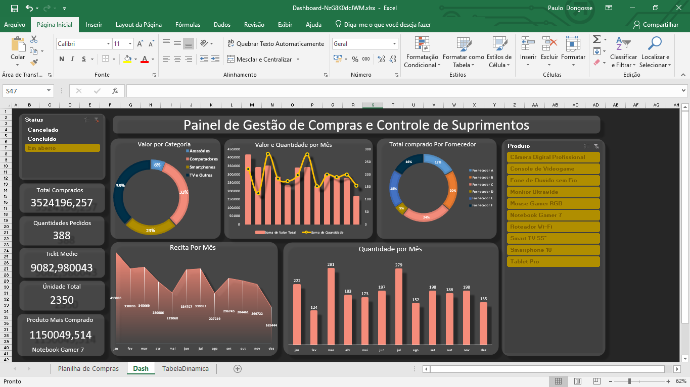
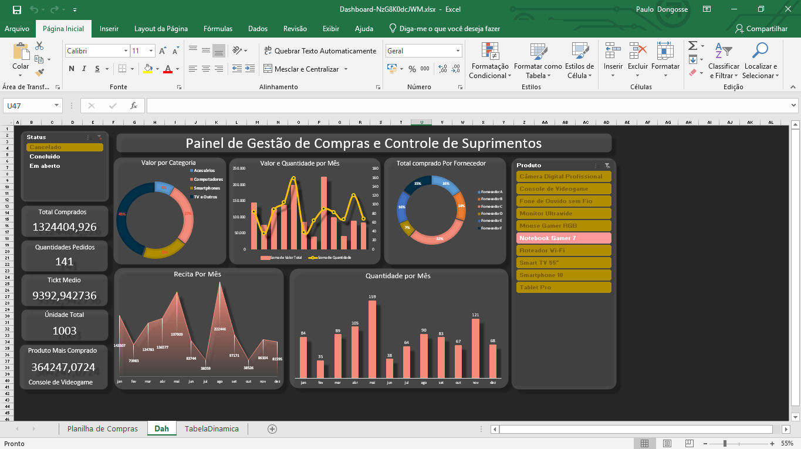

# 📊 Dashboard de Gestão de Compras e Controle de Suprimentos

  
  
  

Este projeto consiste na criação de um **painel interativo de gestão de compras** utilizando Excel Avançado e Tabelas Dinâmicas, com foco em transformar dados operacionais em informações estratégicas para apoio à tomada de decisão.

O objetivo principal é permitir uma visão clara sobre desempenho de compras, fornecedores, produtos, categorias e comportamento mensal do negócio.

---

## 🎯 Objetivo do Projeto

Transformar uma base de dados de compras em um **dashboard gerencial**, capaz de responder perguntas estratégicas como:

- Quais categorias geram mais faturamento?
- Quais fornecedores concentram maior volume de compras?
- Como está a evolução mensal de pedidos e receita?
- Quais produtos mais impactam o resultado?
- Como está o ticket médio ao longo do tempo?

---

## 🧠 Visão Analítica

O painel foi desenvolvido com foco em **Business Intelligence**, permitindo:

- Identificação de quedas de desempenho mensal
- Análise de concentração de faturamento em poucos produtos
- Avaliação de dependência de fornecedores
- Monitoramento de volume vs. receita
- Apoio à tomada de decisão com base em dados

---

## 📈 Indicadores (KPIs)

O dashboard acompanha os seguintes indicadores:

- Total comprado  
- Quantidade de pedidos  
- Ticket médio  
- Unidades totais  
- Produto mais comprado  
- Receita mensal  
- Valor por categoria  
- Compras por fornecedor  
- Quantidade de pedidos por mês  

---

## 📊 Análises Disponíveis

### 🔹 Análise por Categoria
Visualização da participação percentual de cada categoria no faturamento total.

### 🔹 Análise Mensal
Comparativo entre:
- Valor total comprado por mês  
- Quantidade de pedidos por mês  
- Receita mensal  

Permite identificar sazonalidades, quedas e picos de desempenho.

### 🔹 Análise por Fornecedor
Avaliação da concentração de compras por fornecedor, apoiando negociações e gestão de risco.

### 🔹 Ranking de Produtos
Identificação dos produtos com maior impacto no faturamento.

---

## 🎛 Filtros Interativos

O painel conta com segmentações de dados para:

- Status do pedido (Concluído, Cancelado, Em aberto)
- Produto

Esses filtros permitem análises dinâmicas e personalizadas.

---

## 🛠 Ferramentas Utilizadas

- Excel Avançado  
- Tabelas Dinâmicas  
- Segmentação de Dados  
- Gráficos Interativos  
- Modelagem de Indicadores  
- Organização e tratamento de base de dados  

---

## 📌 Principais Insights

- Oscilações mensais de receita e volume indicam possíveis efeitos de sazonalidade  
- Concentração de faturamento em poucos produtos gera risco de dependência  
- Dependência de poucos fornecedores pode impactar negociações e abastecimento  
- Em alguns períodos, aumento de volume não gera crescimento proporcional de receita  

---

## 🚀 Conclusão

Este projeto demonstra como dados operacionais podem ser transformados em uma poderosa ferramenta de gestão quando bem estruturados, analisados e visualizados.

Mais do que um dashboard, trata-se de uma solução de **inteligência de negócio aplicada**.

---

## 👨‍💻 Autor

**Paulo João Dongosse**  
Estudante de Ciência da Computação  
Foco em Análise de Dados, BI e Inteligência Artificial  

📌 Ferramentas: SQL | Python | Excel | Power BI | IA  

---

## 📎 Preview

> Dashboard interativo desenvolvido em Excel com visão executiva e filtros dinâmicos.

